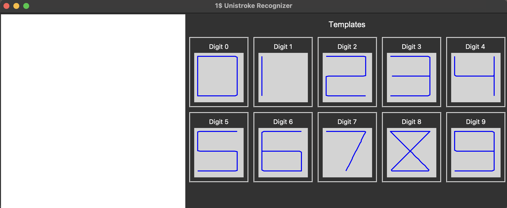
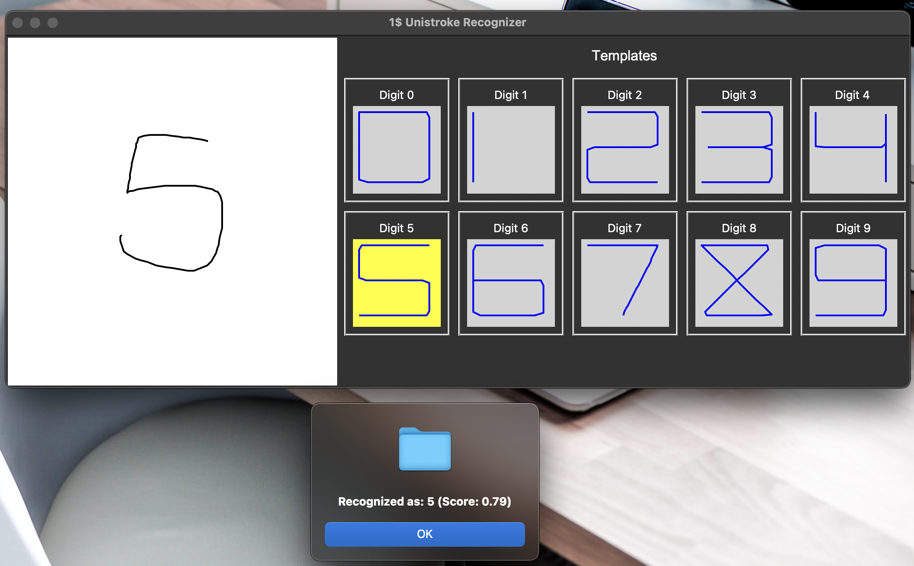
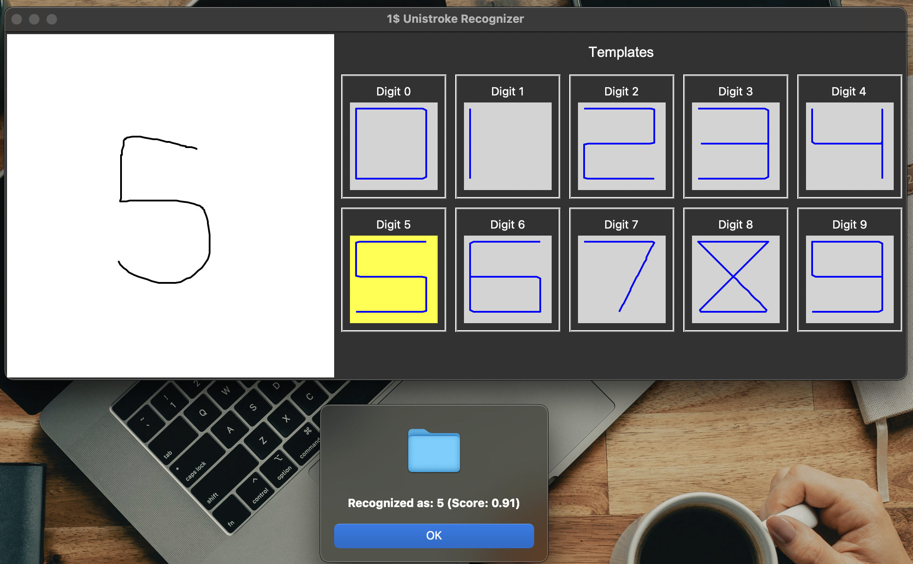

# Report
Here is the panel created by this code:

## Introduction
The $1 Unistroke Recognizer is a simple, efficient algorithm designed for recognizing gestures and strokes. It uses template matching by resampling input strokes, scaling and translating them to a reference frame, and then computing a score based on their similarity to predefined templates. In this project, I implemented the recognizer and tested it using Palm Pilot Graffiti patterns (digits 0-9) with two different settings for the number of samples (N).

## Implementation Detail
* Programming Language: The recognizer was implemented using Python.
  
* Main Features:
 1. Resampling: Each stroke is resampled to N evenly spaced points.
 2. Rotation Invariance: The input is rotated to align optimally with the template using indicative angle rotation.
 3. Scaling and Translation: The stroke is scaled to a reference square and translated to the origin.
 4. Matching Algorithm: The optimal template is determined by calculating the minimum distance between the points of the resampled input and template.
   
* Different N settings: (Number of sample points)
1. N=32: python main.py -n 32
2. N=64: python main.py -n 64

## Results and Observations
* Accuracy: Increasing the number of resampled points (N = 64) led to improved accuracy in recognizing more complex strokes, such as digits with more curves or detail. However, this setting was computationally more intensive compared to N = 32.
* Performance: With N = 32, recognition was faster, making it suitable for simpler gestures and less resource-constrained environments.

## Screenshots
In the screenshots folder, we have digits 0-9 for N=32 and N=64. Here is 2 examples.
N=32, digit=5:

N=64, digit=5:

# Reference
* [Back to the Future of Hand writing Recognition](https://jackschaedler.github.io/handwriting-recognition/)
* [Graffiti (Palm OS)](https://en.wikipedia.org/wiki/Graffiti_(Palm_OS))